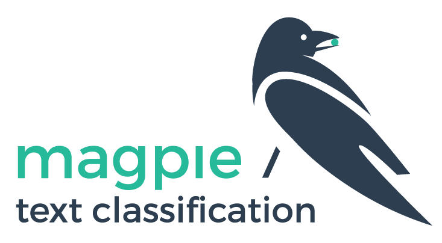

Magpie is a deep learning tool for multi-label text classification. It learns on the training corpus to assign labels to arbitrary text and can be used to predict those labels on unknown data. It has been developed at CERN to assign subject categories to High Energy Physics abstracts and extract keywords from them.

## Very short introduction
```
$ ls training-directory
100.txt  100.lab  101.txt  101.lab  102.txt  102.lab  ...
$ python
>>> from magpie import MagpieModel
>>> model = MagpieModel()
>>> model.init_word_vectors('/path/to/training-directory', vec_dim=100)
>>> model.train('/path/to/training-directory', ['label1', 'label2', 'label3'], nb_epochs=10)
Training...
>>> model.predict_from_text(u'Well that was quick...')
[('label1', 0.84), ('label2', 0.26), ('label3', 0.04)]
```


## Short introduction
To train the model you need to have a large corpus of labeled data in a text format. Magpie looks for `.txt` files containing the text to predict on and corresponding `.lab` files with assigned labels in separate lines. A pair of files containing the labels and the text should have the same name and differ only in extensions e.g.

```
$ ls training-directory
100.txt  100.lab  101.txt  101.lab  102.txt  102.lab  ...
```

Before you train the model, you need to build appropriate word vector representations for your corpus. In theory, you can train them on a different corpus or reuse already trained ones ([tutorial](http://rare-technologies.com/word2vec-tutorial/)), however Magpie enables you to do that as well.
```python
from magpie import MagpieModel

model = MagpieModel()
model.train_word2vec('/path/to/training-directory', vec_dim=100)
```

Then you need to fit a scaling matrix to normalize input data, it is specific to the trained word2vec representation. Here's the one liner:

```python
model.fit_scaler('/path/to/training-directory')
```

You would usually want to combine those two steps, by simply running:
```python
model.init_word_vectors('/path/to/training-directory', vec_dim=100)
```

If you plan to reuse the trained word representations, you might want to save them and pass in the constructor to `MagpieModel`next time. For the training, just type:
```python
model.train('/path/to/training-directory', ['label1', 'label2', 'label3'],
            test_dir='/optional/test/directory', nb_epochs=30)
```
By providing the `test_dir` argument, the model is evaluated after every epoch and displays it's current loss and accuracy. If your data doesn't fit into memory, you can also run `model.batch_train()` which has the same API, but is more memory efficient.

Trained models can be used for prediction with methods:
```python
model.predict_from_file('/path/to/txt/file')
# yields [('label1', 0.97), ('label3', 0.32), ('label2', 0.02)]

model.predict_from_text(u'This text should preferably be longer to give more information to the NN')
# yields [('label3', 0.47), ('label1', 0.12), ('label2', 0.003)]
```
## Saving & loading the model
A `MagpieModel` object consists of three components - the word2vec mappings, a scaler and a `keras` model. In order to train Magpie you can either provide the word2vec mappings and a scaler in advance or let the program compute them for you on the training data. Usually you would want to train them yourself on a full dataset and reuse them afterwards. You can use the provided functions for that purpose:

```python
model.init_word_vectors('/path/to/directory-with-text', vec_dim=100)
model.train('/train/path', ['cat', 'dog', 'cow'], nb_epochs=10)

model.save_word2vec_model('/save/my/embeddings/here')
model.save_scaler('/save/my/scaler/here', overwrite=True)
model.save_model('/save/my/model/here.h5')
```

When you want to reinitialize your trained model, you can run:

```python
mm = MagpieModel(
    keras_model='/save/my/model/here.h5',
    word2vec_model='/save/my/embeddings/here',
    scaler='/save/my/scaler/here',
    labels=['cat', 'dog', 'cow']
)
```
or just pass the objects directly!

## Installation
The package has several dependencies, we're working to reduce this number. Before downloading Magpie, make sure to install:
 - [numpy](http://www.numpy.org/)
 - [keras](https://github.com/fchollet/keras) with Theano or TensorFlow backend.
 - [gensim](http://radimrehurek.com/gensim/)
 - [scikit-learn](http://scikit-learn.org/stable/index.html)
 - [nltk](http://www.nltk.org/install.html)

Afterwards, install the package from GitHub:
```
$ pip install git+https://github.com/jstypka/magpie.git
```

## Contact
If you have any problems, feel free to open an issue. We'll do our best to help :+1:
